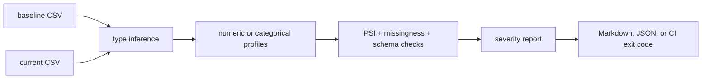

# data-shift-watch

`data-shift-watch` is a tiny MLOps CLI that compares a baseline CSV with a current CSV and flags columns whose distributions changed. It is built for the moment before a scheduled model job, batch scoring run, or retraining pipeline quietly consumes data that no longer looks like the data you trusted.

## Why it is useful

Model quality often degrades because the input data changes before anyone notices. This tool gives teams a lightweight check that can run locally, in CI, or inside an automation job without a metrics platform.

## Features

- numeric drift with population stability index (PSI)
- categorical drift with unseen-category detection
- missing-rate change checks
- schema checks for new or missing columns
- default skipping for obvious high-cardinality ID columns
- Markdown reports for humans and JSON reports for automation
- CI-friendly exit codes with `--fail-on`

## Installation

```bash
git clone https://github.com/mertefekurt/data-shift-watch.git
cd data-shift-watch
python -m pip install -e ".[dev]"
```

## Usage

Create a Markdown report:

```bash
data-shift-watch examples/baseline.csv examples/current.csv -o report.md
```

Emit JSON for another tool:

```bash
data-shift-watch examples/baseline.csv examples/current.csv --format json
```

Fail a pipeline when drift is high:

```bash
data-shift-watch examples/baseline.csv examples/current.csv --fail-on high
```

Focus on selected model features:

```bash
data-shift-watch baseline.csv current.csv --include age,plan,monthly_spend --exclude customer_id
```

## CLI options

```text
baseline                 reference CSV
current                  CSV to compare against the baseline
--format markdown|json   report format
-o, --output PATH        write report to a file
--include COLUMNS        comma-separated columns to analyze
--exclude COLUMNS        comma-separated columns to skip
--fail-on LEVEL          return exit code 2 at low, medium, or high severity
--numeric-bins N         bucket count for numeric PSI
--max-categories N       tracked categorical values before grouping into OTHER
--include-id-like        include high-cardinality identifier-like columns
--top N                  number of columns shown in Markdown
```

## Workflow



## Tests

```bash
ruff check .
pytest
python -m data_shift_watch --help
```

## License

MIT
