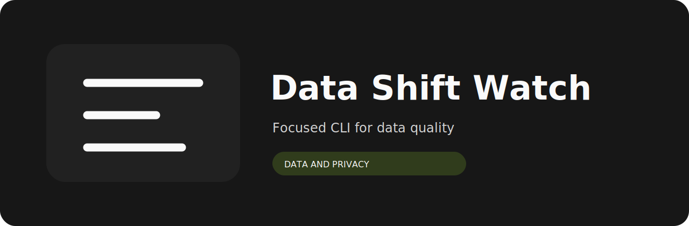
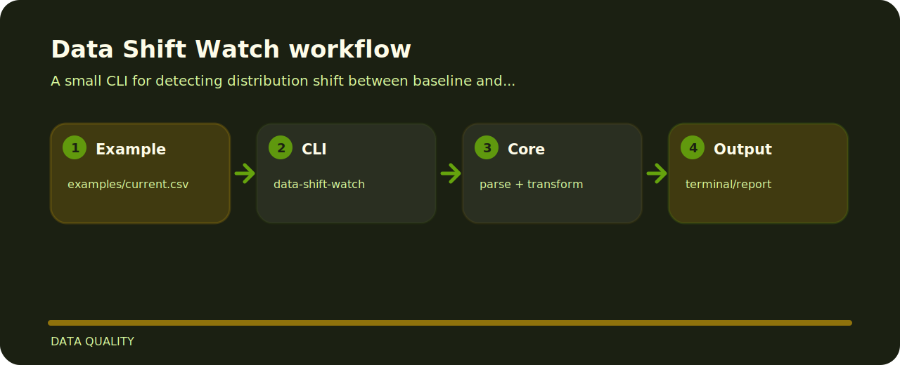

# Data Shift Watch

This project is a small, inspectable data quality tool. It prefers concrete examples and local files over hidden setup.



## Open these first

```text
.github/        CI workflow
examples/       sample inputs
src/            package source
tests/          test coverage
.gitignore      project file
```

## Try the sample

```bash
git clone https://github.com/mertefekurt/data-shift-watch.git
cd data-shift-watch
python -m pip install -e ".[dev]"
data-shift-watch examples/current.csv
```

## Project flow


